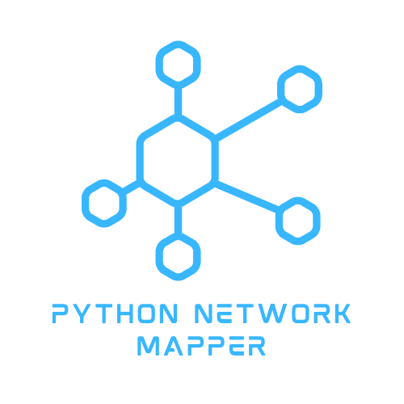

<!-- PROJECT LOGO -->
 

  

  <h3 align="center">Python Network Mapper</h3>

  

    A toy project to understand how socket programming works on python.
     
     
     
    <a href="https://github.com/CMMiraflor/Python-Port-Scanner">View Demo</a>
    ·
    <a href="https://github.com/CMMiraflor/Python-Port-Scanner/issues">Report Bug</a>
    ·
    <a href="https://github.com/CMMiraflor/Python-Port-Scanner/issues">Request Feature</a>
  

**Prerequisites**
- Python 3.3 (or above)
    - pip
- internet connection (for set up)

**Installation**
 
`pip install -r requirements.txt`

**How to run**
 
`python3 Scanner.py`
